# Part 1: Basic SQL Operations and JOIN Queries

### 1.  Basic Selection: Retrieve the titles and publication years of all books published after 2000,     ordered by publication year (newest first).    

```sql
SELECT title,
       publication_year
  FROM books
 WHERE publication_year > 2000
 ORDER BY publication_year DESC;
```

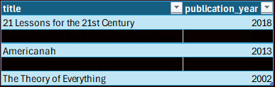

### 2.  Filtering: Find all books with more than 5 copies owned in the fiction genre (genre_id = 1).

```sql
SELECT title,
       genre_id,
       copies_owned
  FROM books
 WHERE genre_id = 1 AND
       copies_owned > 5;
```

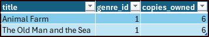

### 3.  Pattern Matching: List all books whose titles contain the word "History".

```sql
SELECT book_id,
       title
  FROM books
 WHERE title LIKE ('%history%');
```
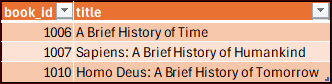


### 4.  JOIN Operations: Display loan information (loan_id, checkout_date, due_date) along with patron details (first_name, last_name, email) for all loans made in January 2023.

```sql
SELECT a.loan_id,
       a.checkout_date,
       a.due_date,
       b.first_name,
       b.last_name,
       b.email
  FROM loans a
       LEFT JOIN
       patrons b ON a.patron_id = b.patron_id
 WHERE a.checkout_date LIKE ('2023-01%');
```

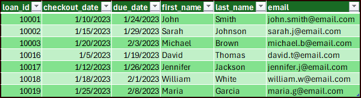

### 5.  Multi-table JOIN: Show book details (title, author's full name, genre_name) for each loan, along with the checkout_date and due_date.

```sql
SELECT a.loan_id,
       a.checkout_date,
       a.due_date,
       b.title,
       c.last_name || ', ' || c.first_name AS author_full_name,
       d.genre_name
  FROM loans a
       LEFT JOIN
       books b ON a.book_id = b.book_id
       LEFT JOIN
       authors c ON b.author_id = c.author_id
       LEFT JOIN
       genres d ON b.genre_id = d.genre_id;
```

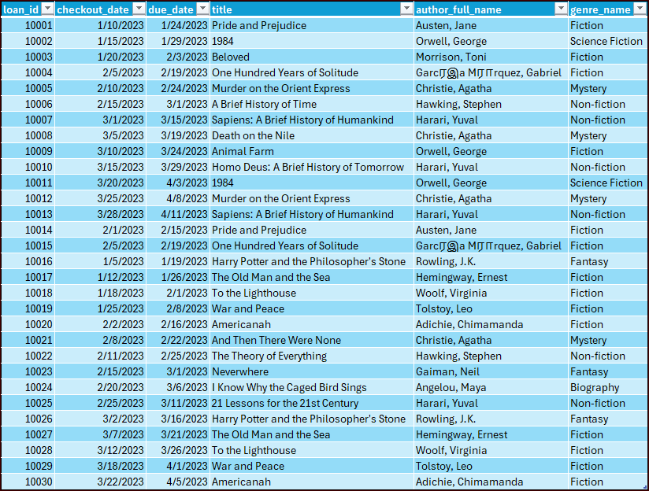

### 6.  Self JOIN: Find pairs of patrons who live in the same city. Show both patrons' names and their city.
 
```sql 
SELECT a.first_name || ' ' || a.last_name AS patron_1,
       b.first_name || ' ' || b.last_name AS patron_2,
       a.city
  FROM patrons a
       JOIN
       patrons b ON a.city = b.city AND
                    a.patron_id < b.patron_id
 GROUP BY a.city
HAVING COUNT( * ) = 1
 ORDER BY a.city;
```

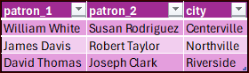

### 7.  Multi-table JOIN with filtering: Find all fiction books (genre_id = 1) that have been borrowed, along with the patron name and the branch where they were borrowed from.

```sql
SELECT a.title,
       c.last_name || ', ' || c.first_name AS patron_name,
       d.branch_name
  FROM books a
       LEFT JOIN
       loans b ON a.book_id = b.book_id
       LEFT JOIN
       patrons c ON b.patron_id = c.patron_id
       LEFT JOIN
       branches d ON b.branch_id = d.branch_id
 WHERE a.genre_id = 1 AND
       b.book_id IS NOT NULL
 ORDER BY a.title;
```

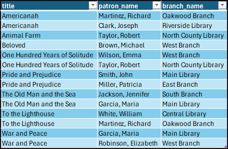

# Part 2: Aggregation and GROUP BY Operations

### 8.	COUNT aggregation: Count the number of books in each genre category.

```sql
SELECT a.genre_id,
       b.genre_name,
       count(DISTINCT (a.book_id) ) AS books
  FROM books a
       LEFT JOIN
       genres b ON a.genre_id = b.genre_id
 GROUP BY a.genre_id,
          b.genre_name;
```

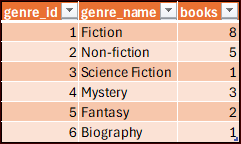

### 9.  Multiple aggregations: Calculate the average, minimum, and maximum loan duration (days between checkout and return) for each library branch. Include only returned books.

```sql
SELECT a.branch_name,
       count(b.return_date) AS book_returns,
       round(avg(julianday(b.return_date) - julianday(b.checkout_date) ), 0) AS avg_duration,
       round(min(julianday(b.return_date) - julianday(b.checkout_date) ), 0) AS min_duration,
       round(max(julianday(b.return_date) - julianday(b.checkout_date) ), 0) AS max_duration
  FROM branches a
       LEFT JOIN
       loans b ON a.branch_id = b.branch_id
 WHERE b.return_date <> ''
 GROUP BY a.branch_name;
``` 

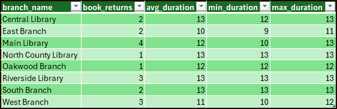

### 10.  Conditional aggregation: Find patrons with overdue books (due_date < CURRENT_DATE and return_date = ' '), along with the count of overdue books they have.

```sql 
SELECT a.last_name || ', ' || a.first_name AS patron_name,
       count(loan_id) AS books_overdue
  FROM patrons a
       LEFT JOIN
       loans b ON a.patron_id = b.patron_id
 WHERE b.return_date = '' AND
       julianday(b.due_date) < julianday(CURRENT_DATE) 
 GROUP BY a.last_name,
          a.first_name
 ORDER BY patron_name;
``` 

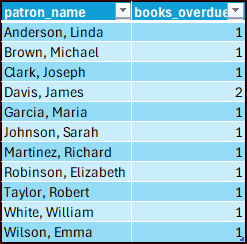

### 11.  Time-based analysis: Analyze monthly borrowing trends.  Show the year, month, number of loans, and number of unique patrons for each month.

```sql
SELECT strftime('%Y-%m', a.checkout_date) AS loan_month,
       count(DISTINCT (loan_id) ) AS num_loans,-- count(patron_id) as num_patrons,
       count(DISTINCT (patron_id) ) AS num_unique_patrons
  FROM loans a
 GROUP BY strftime('%Y-%m', a.checkout_date);
```

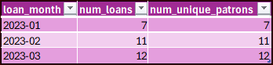

### BONUS: Write a query to create a simple data dictionary for the library database schema, listing table names, column names, data types, and whether they are primary keys.

```sql
SELECT a.name AS table_name,
       b.name AS coumn_name,
       b.type AS data_type,
       b.cid AS column_id,
       CASE
           WHEN b.pk = 1 THEN 'Yes'
           ELSE ''
       END AS is_primary_key
  FROM sqlite_schema a
       JOIN
       pragma_table_info(a.name) AS b
 WHERE a.type = 'table' AND
       a.name NOT LIKE ('sqlite_%') 
 ORDER BY table_name,
          b.cid;
```

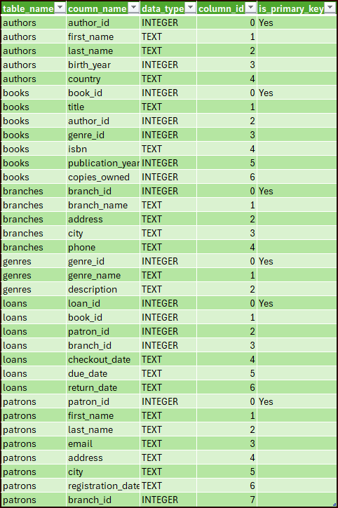

# Discussion Questions

### 1. In our library database, we track which branch a book was borrowed from, but books can exist at multiple branches. How would you modify the schema to track the actual inventory at each branch?

- **Create an inventory table with branch_id and book_id**

### 2. Based on the provided data model, what business questions could library administrators answer using SQL queries that we haven't covered in our exercise?

- **Which patrons should be able to borrow books until they return the ones they have or pay the fine.**
- **Which books are more popular at certain branches and how to manage inventory based on that.**

### 3. How would you extend this schema to track additional patron interactions, such as reserved books, late fees, or participation in library programs?

- **Add an inventory table.**
- **Add late fees per loan_id in loans table.**
- **Add genre_id and auther_id to loans table.**

### 4. For tasks 1-3, how could you combine them into a single, more complex query that finds recent history books with multiple copies?

- **Combine the filters in the 'Where' statement.**

### 5. What performance considerations should be kept in mind when running complex joins and aggregations on large library datasets?

- **Clean joins that are '=' instead of '<,>' more efficient**
- **Large data sets with subqueries and multiple comoutations can slow the db down or even error out.**
